# Strategy Design Pattern - UML Diagrams

## 1. Strategy Pattern - Class Diagram

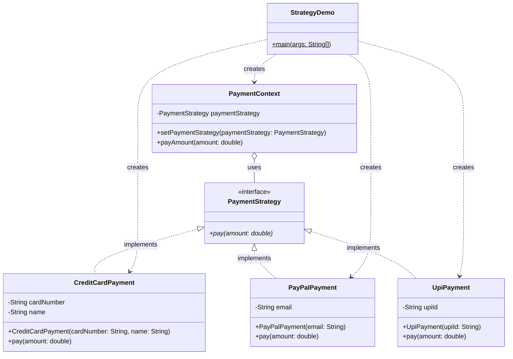

---

## 2. Sequence Diagram - Payment Flow

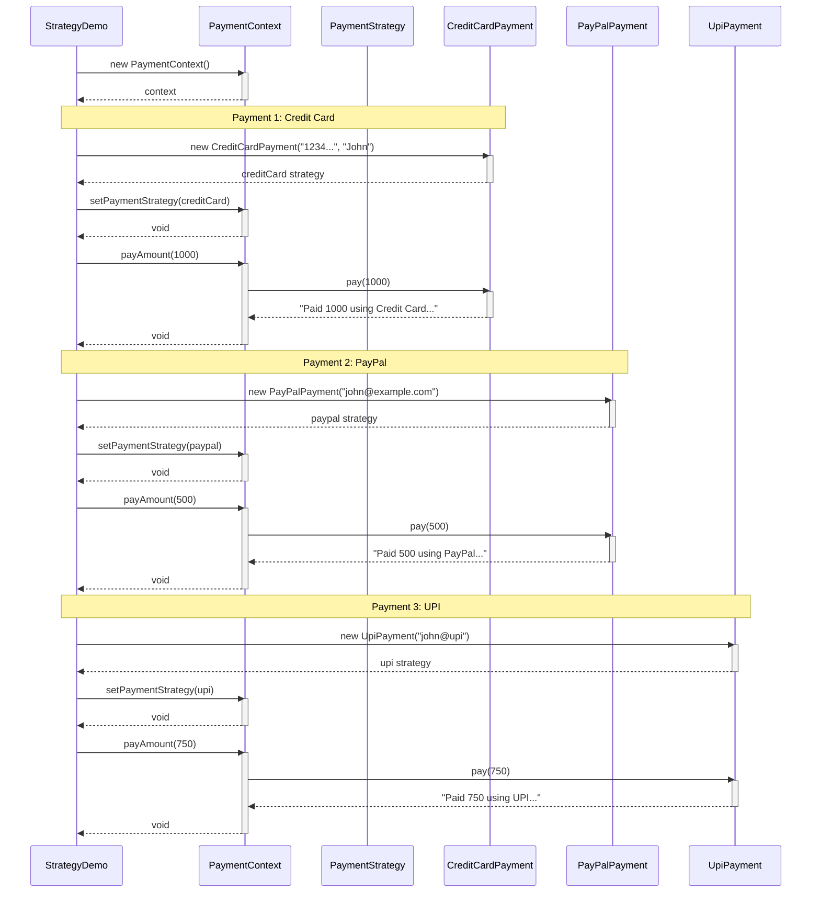

---

## 3. Strategy Pattern Flow

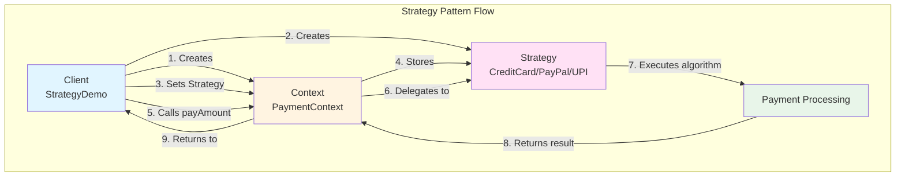

---

## 4. Strategy Selection at Runtime

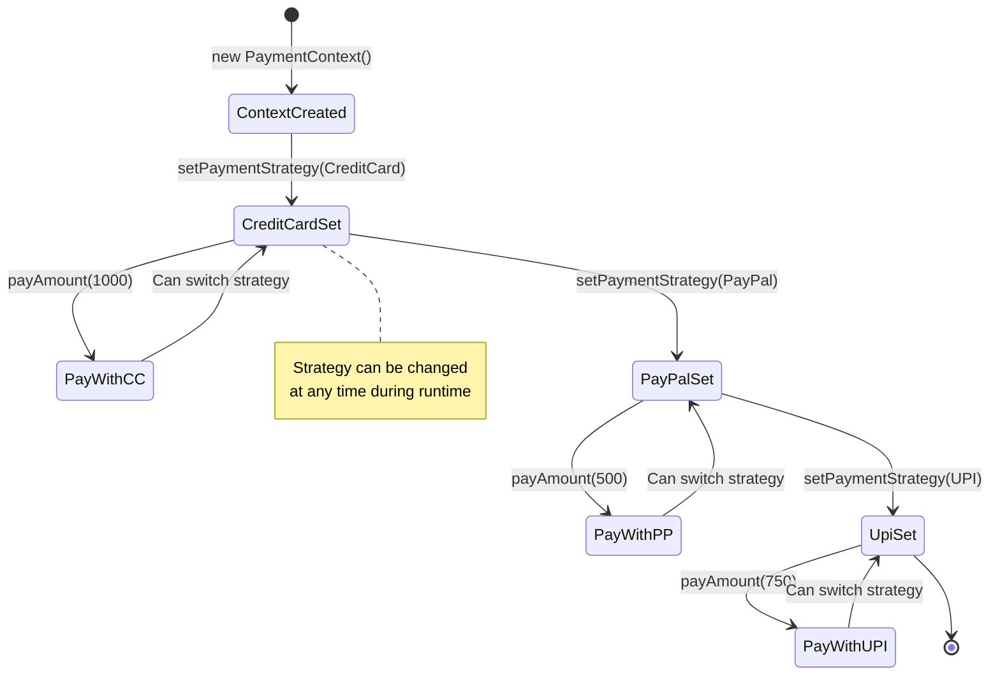

---

## 5. Comparison: Without vs With Strategy Pattern

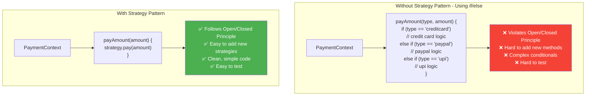

---

## 6. Design Explanation

### What is the Strategy Pattern?

**Strategy Pattern** is a behavioral design pattern that defines a family of algorithms, encapsulates each one, and makes them interchangeable. Strategy lets the algorithm vary independently from clients that use it.

### Key Components

1. **Strategy Interface (PaymentStrategy)**:
   - Declares the common interface for all strategies
   - Method: `pay(double amount)`
   - All concrete strategies must implement this

2. **Concrete Strategies (CreditCardPayment, PayPalPayment, UpiPayment)**:
   - Implement the Strategy interface
   - Each encapsulates a specific algorithm/behavior
   - Can have their own instance variables
   - Independent and interchangeable

3. **Context (PaymentContext)**:
   - Maintains a reference to a Strategy object
   - Delegates the algorithm execution to the strategy
   - Can switch strategies at runtime
   - Provides `setPaymentStrategy()` to change strategy

4. **Client (StrategyDemo)**:
   - Creates concrete strategy objects
   - Passes strategy to context
   - Calls context methods
   - Can change strategy dynamically

---

## 7. How Your Code Works

### Step-by-Step Execution

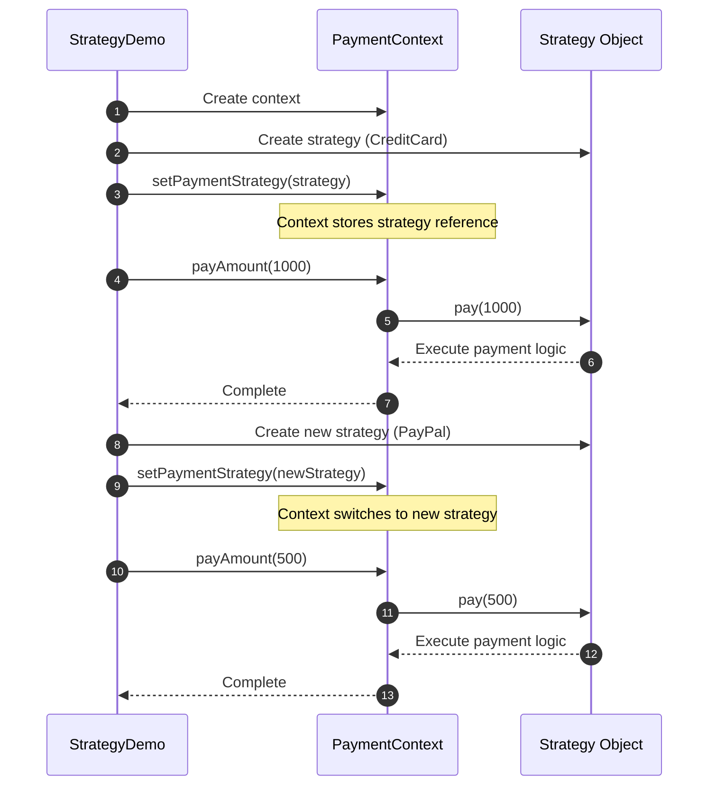

---

## 8. Strategy Pattern Structure

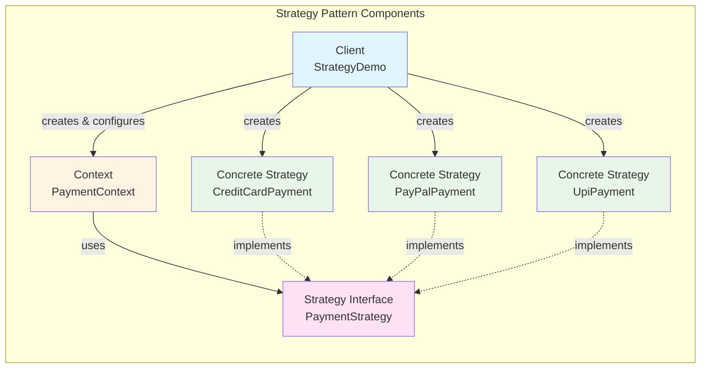

---

## 9. Advantages & Disadvantages

### ✅ Advantages

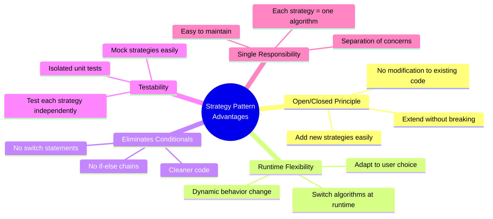

### ❌ Disadvantages

| Disadvantage | Description |
|-------------|-------------|
| **More Classes** | Need to create multiple strategy classes |
| **Client Awareness** | Client must know about different strategies |
| **Object Overhead** | Creates many objects at runtime |
| **Simple Cases** | Overkill for simple algorithms |

---

## 10. When to Use Strategy Pattern

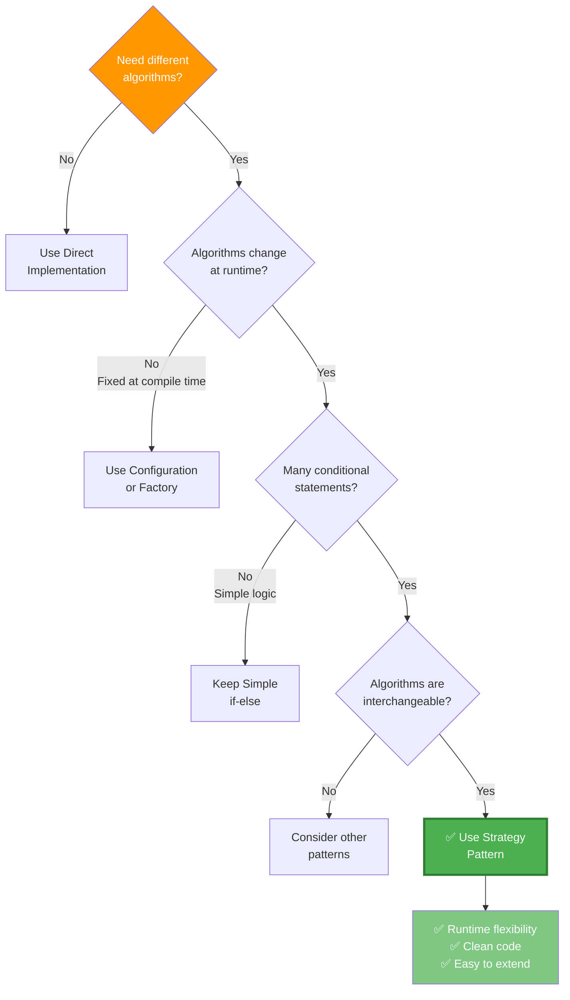

---

## 11. Real-World Examples

### Common Use Cases

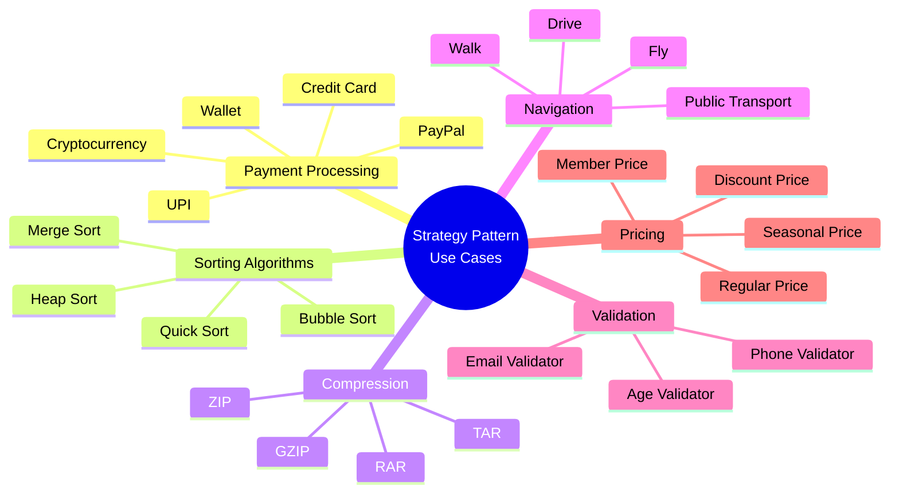

---

## 12. Adding New Strategy - Example

### Adding BitcoinPayment

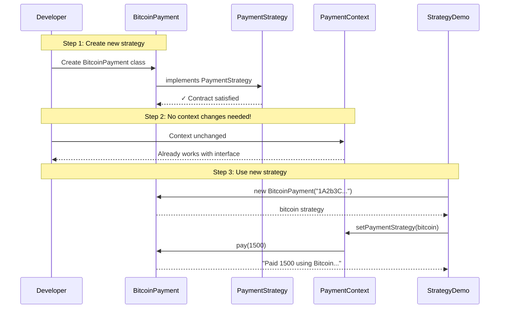

### Code to Add Bitcoin Payment

```java
// 1. Create new strategy class - implements interface
package com.example.strategy;

public class BitcoinPayment implements PaymentStrategy {
    private String walletAddress;

    public BitcoinPayment(String walletAddress) {
        this.walletAddress = walletAddress;
    }

    @Override
    public void pay(double amount) {
        System.out.println("Paid " + amount + " using Bitcoin: " + walletAddress);
    }
}

// 2. Context class - NO CHANGES NEEDED!

// 3. Client code - Just use the new strategy
public class StrategyDemo {
    public static void main(String[] args) {
        PaymentContext context = new PaymentContext();
        
        // Use new Bitcoin payment strategy
        context.setPaymentStrategy(new BitcoinPayment("1A2b3C4d5E6f"));
        context.payAmount(1500);
        // Output: Paid 1500.0 using Bitcoin: 1A2b3C4d5E6f
    }
}
```

---

## 13. Strategy vs Other Patterns

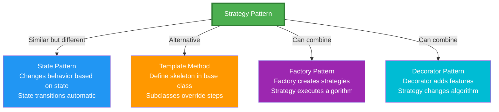

---

## 14. SOLID Principles Applied

### How Strategy Pattern Follows SOLID

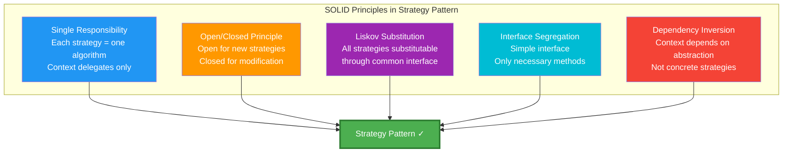

---

## 15. Your Implementation Analysis

### Code Structure Breakdown

**PaymentStrategy.java** (Strategy Interface):
```java
✅ Simple, focused interface
✅ Single method: pay(amount)
✅ All strategies implement this
✅ Defines contract for all payment methods
```

**CreditCardPayment.java** (Concrete Strategy):
```java
✅ Implements PaymentStrategy
✅ Has specific data: cardNumber, name
✅ Encapsulates credit card logic
✅ Independent of other strategies
```

**PayPalPayment.java** (Concrete Strategy):
```java
✅ Implements PaymentStrategy
✅ Has specific data: email
✅ Encapsulates PayPal logic
✅ Can be tested independently
```

**UpiPayment.java** (Concrete Strategy):
```java
✅ Implements PaymentStrategy
✅ Has specific data: upiId
✅ Encapsulates UPI logic
✅ Easy to add validations
```

**PaymentContext.java** (Context):
```java
✅ Holds reference to strategy
✅ Delegates to strategy.pay()
✅ Allows strategy switching
✅ Decoupled from concrete strategies
```

**StrategyDemo.java** (Client):
```java
✅ Creates context once
✅ Creates different strategies
✅ Switches strategies at runtime
✅ Clean, readable code
```

---

## 16. Improvement Suggestions

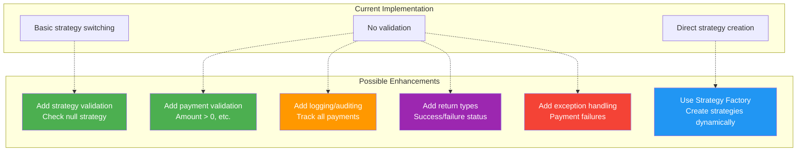

### Enhanced Version with Validation

```java
// Enhanced Strategy Interface with return type
public interface PaymentStrategy {
    boolean pay(double amount) throws PaymentException;
}

// Enhanced Context with validation
public class PaymentContext {
    private PaymentStrategy paymentStrategy;

    public void setPaymentStrategy(PaymentStrategy paymentStrategy) {
        if (paymentStrategy == null) {
            throw new IllegalArgumentException("Payment strategy cannot be null");
        }
        this.paymentStrategy = paymentStrategy;
    }

    public boolean payAmount(double amount) {
        if (paymentStrategy == null) {
            throw new IllegalStateException("Payment strategy not set");
        }
        if (amount <= 0) {
            throw new IllegalArgumentException("Amount must be positive");
        }
        
        try {
            return paymentStrategy.pay(amount);
        } catch (PaymentException e) {
            System.err.println("Payment failed: " + e.getMessage());
            return false;
        }
    }
}

// Enhanced Concrete Strategy with validation
public class CreditCardPayment implements PaymentStrategy {
    private String cardNumber;
    private String name;

    public CreditCardPayment(String cardNumber, String name) {
        if (cardNumber == null || cardNumber.length() < 13) {
            throw new IllegalArgumentException("Invalid card number");
        }
        this.cardNumber = cardNumber;
        this.name = name;
    }

    @Override
    public boolean pay(double amount) throws PaymentException {
        // Simulate payment processing
        if (amount > 10000) {
            throw new PaymentException("Transaction limit exceeded");
        }
        System.out.println("Paid " + amount + " using Credit Card: " + cardNumber);
        return true;
    }
}
```

---

## 17. Strategy Pattern with Factory

### Combining Strategy with Factory Pattern

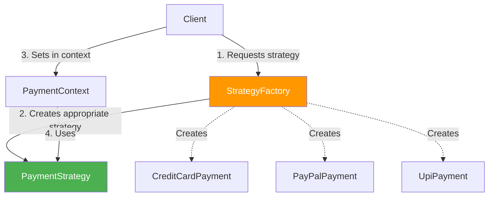

```java
// Strategy Factory
public class PaymentStrategyFactory {
    public static PaymentStrategy createStrategy(String type, String... params) {
        switch (type.toLowerCase()) {
            case "creditcard":
                return new CreditCardPayment(params[0], params[1]);
            case "paypal":
                return new PayPalPayment(params[0]);
            case "upi":
                return new UpiPayment(params[0]);
            default:
                throw new IllegalArgumentException("Unknown payment type: " + type);
        }
    }
}

// Usage
PaymentContext context = new PaymentContext();

// Create strategies using factory
PaymentStrategy strategy1 = PaymentStrategyFactory.createStrategy(
    "creditcard", "1234-5678", "John Doe"
);
context.setPaymentStrategy(strategy1);
context.payAmount(1000);

PaymentStrategy strategy2 = PaymentStrategyFactory.createStrategy(
    "paypal", "john@example.com"
);
context.setPaymentStrategy(strategy2);
context.payAmount(500);
```

---

## 18. Complete Execution Flow

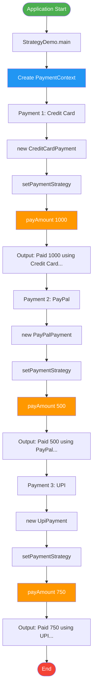

---

## 19. Testing Strategies Independently

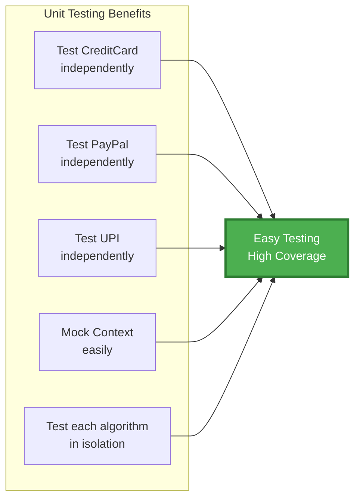

### Example Unit Test

```java
import org.junit.Test;
import static org.junit.Assert.*;

public class PaymentStrategyTest {
    
    @Test
    public void testCreditCardPayment() {
        PaymentStrategy strategy = new CreditCardPayment("1234-5678", "John");
        // Test that it doesn't throw exception
        strategy.pay(100.0);
    }
    
    @Test
    public void testPayPalPayment() {
        PaymentStrategy strategy = new PayPalPayment("john@example.com");
        strategy.pay(50.0);
    }
    
    @Test
    public void testContextSwitchesStrategies() {
        PaymentContext context = new PaymentContext();
        
        // Set and use first strategy
        PaymentStrategy cc = new CreditCardPayment("1234", "John");
        context.setPaymentStrategy(cc);
        context.payAmount(100);
        
        // Switch to second strategy
        PaymentStrategy pp = new PayPalPayment("john@example.com");
        context.setPaymentStrategy(pp);
        context.payAmount(50);
        
        // Both should work without issues
    }
}
```

---

## 20. Summary

### Strategy Pattern Overview

| Aspect | Description |
|--------|-------------|
| **Pattern Type** | Behavioral |
| **Purpose** | Define family of algorithms, make them interchangeable |
| **Problem Solved** | Eliminates conditional statements for algorithm selection |
| **Key Benefit** | Runtime algorithm switching, clean code |
| **Trade-off** | More classes vs cleaner logic |
| **Best For** | Multiple interchangeable algorithms, runtime selection |

### Your Implementation Summary

✅ **Perfectly implemented** - All Strategy pattern principles followed  
✅ **Clean separation** - Each payment method is independent  
✅ **Runtime flexibility** - Can switch payment methods anytime  
✅ **Easy to extend** - Add new payment methods without changing existing code  
✅ **Testable** - Each strategy can be tested independently  
✅ **Follows SOLID** - Open/Closed, Single Responsibility, Dependency Inversion  

### Expected Output

```
Paid 1000.0 using Credit Card: 1234-5678-9876-5432
Paid 500.0 using PayPal: john@example.com
Paid 750.0 using UPI: john@upi
```

---

## GitHub Integration

Copy this entire markdown file to your GitHub repository. All Mermaid diagrams will render automatically!

### Recommended File Structure:
```
your-repo/
├── README.md (this documentation)
├── src/
│   └── com/example/strategy/
│       ├── PaymentStrategy.java
│       ├── CreditCardPayment.java
│       ├── PayPalPayment.java
│       ├── UpiPayment.java
│       ├── PaymentContext.java
│       └── StrategyDemo.java
├── test/
│   └── PaymentStrategyTest.java
└── docs/
    └── STRATEGY_PATTERN.md
```
